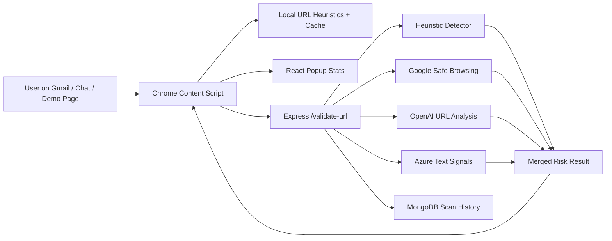

# ScamSpot

ScamSpot is a phishing-detection Chrome extension and optional Node/Express backend for flagging risky links in email and chat workflows. It works immediately in the browser with client-side heuristics, and it can connect to a backend for OpenAI, Azure Text Analytics, Google Safe Browsing, and MongoDB-backed scan history.

## Overview

ScamSpot helps people spot suspicious links before they click them. The extension scans supported web apps, highlights risky URLs, shows a warning overlay with reasons and risk score, and tracks scan stats in a compact popup.

The project is designed as a portfolio-grade full-stack security tool: a real Chrome extension, a React/TypeScript popup, a Node/Express backend, MongoDB persistence, concurrent detector orchestration, and automated adversarial tests.

## Problem

Phishing links often appear inside trusted workflows: email inboxes, messaging apps, social DMs, and shared documents. Users rarely have enough context to judge a URL quickly, especially when attackers use urgency, brand impersonation, URL shorteners, suspicious TLDs, or lookalike domains.

## Why It Matters

Phishing is one of the most common paths to account takeover, credential theft, payment fraud, and malware delivery. A useful tool needs to be fast, explainable, and resilient when external security APIs are slow or unavailable. ScamSpot focuses on those constraints: local fallback detection, visible warnings, service-level isolation, and clear risk reasons.

## Tech Stack

- **Frontend:** React, TypeScript, Chrome Extension Manifest V3
- **Backend:** Node.js, Express
- **Database:** MongoDB/Mongoose for scan history and high-risk URL persistence
- **ML/AI:** OpenAI URL analysis, Azure Text Analytics context signals, heuristic URL scoring
- **APIs:** Google Safe Browsing, OpenAI REST API, Azure Text Analytics REST API
- **Testing:** Node test runner, React Testing Library, content-script VM tests, 500+ adversarial URL fixtures
- **Deployment/Demo:** Loadable Chrome extension in `extension-dist/`, local backend on `localhost:3000`, local demo page in `demo/`

## Architecture



Backend detectors run independently with per-service timeout and retry handling. A slow or failed upstream returns a service status instead of blocking the response path.

## Key Features

- **Standalone extension mode:** works without backend, API keys, or setup.
- **Six supported platforms:** Gmail, WhatsApp Web, Telegram Web, Instagram, Snapchat Web, and Messenger.
- **Local risk scoring:** suspicious TLDs, IP URLs, excessive subdomains, phishing keywords, brand impersonation, URL shorteners, homographs, long URLs, and insecure HTTP login links.
- **Advanced backend mode:** optional OpenAI, Azure, Google Safe Browsing, and MongoDB integration.
- **Concurrent detector orchestration:** independent services run in parallel with timeouts and retries.
- **Warning UX:** risky links get an outline/badge; clicks open a modal with score, URL, reasons, continue/block actions, and false-positive reporting.
- **Demo surface:** `demo/index.html` provides deterministic suspicious and benign links for live walkthroughs.

## Setup

### 1. Run The Extension Without Backend

```bash
cd chrome-extension
npm install
npm run build:dist
```

Then open Chrome:

1. Go to `chrome://extensions/`
2. Enable **Developer Mode**
3. Click **Load unpacked**
4. Select the `extension-dist/` folder
5. Open Gmail, a supported chat app, or the local demo page

### 2. Demo The Extension Locally

```bash
cd demo
python3 -m http.server 8080
```

Open `http://localhost:8080`. ScamSpot should flag the suspicious sample links and leave the benign links alone.

### 3. Run Advanced Backend Mode

```bash
cd backend
npm install
cp .env.example .env
npm start
```

Add any optional API keys you want to enable in `backend/.env`:

```env
PORT=3000
MONGO=mongodb://localhost:27017/scamspot
OPENAI=
AZUREURL=
AZUREKEY=
GOOGLE_SAFE_BROWSING_API_KEY=
DETECTION_SERVICE_TIMEOUT_MS=3500
DETECTION_SERVICE_RETRIES=1
```

The extension auto-detects the backend via `/health`. When connected, the popup shows **Backend Connected** and content-script scans call `/validate-url`.

### 4. Demo The Backend

With the backend running:

```bash
cd backend
npm run demo
```

The demo posts phishing and benign URLs to `/validate-url` and prints risk scores, reasons, detector statuses, timings, and MongoDB persistence status.

## Verification

Run the main verification command from the repository root:

```bash
npm run verify
```

This runs extension tests, rebuilds and syncs `extension-dist/`, and runs backend tests.

Evidence for the main claims:

- **6 platform coverage:** `chrome-extension/public/manifest.json`
- **Content-script behavior:** `chrome-extension/src/contentScript.test.ts`
- **Concurrent backend detectors:** `backend/services/urlDetectionServices.js`
- **Timeout/retry isolation:** `backend/services/resilience.js`
- **500+ adversarial URL scenarios:** `backend/tests/url_features.adversarial.test.js`
- **MongoDB persistence:** `backend/controllers/bad_linksController.js`, `backend/models/url_scan.js`

## Results / Metrics

- 500+ generated adversarial phishing URL scenarios tested.
- Curated phishing and benign URL fixture coverage.
- Backend resilience tests for concurrency, timeouts, retries, and failure-tolerant result merging.
- Four URL detector paths: local heuristics, Google Safe Browsing, OpenAI URL analysis, and Azure text/context signals.
- Six supported web platforms plus a local demo page.

## Technical Challenges

- Keeping the extension useful without any backend or paid API keys.
- Running independent backend detectors concurrently without letting one upstream failure block the response path.
- Making a content script safe for dynamic web apps where DOM nodes are constantly inserted and removed.
- Avoiding stale extension bundles by adding `npm run build:dist`.
- Testing browser content-script behavior in a CI-friendly Node environment.

## What I Learned

- A security tool needs graceful degradation, not only strong external integrations.
- Browser extensions need durable state because popups are short-lived.
- Risk scoring is more useful when paired with human-readable reasons.
- Demo reliability matters: a controlled local page is better than depending only on Gmail or chat apps during a walkthrough.

## Limitations

ScamSpot is a portfolio project, not commercial anti-phishing infrastructure. It can catch common phishing patterns and demonstrate resilient detector orchestration, but real-world production use would need stronger abuse controls, broader URL intelligence, deployment hardening, rate limiting, monitoring, and a reviewed privacy/security model.


## Project Layout

```text
ScamSpot/
  backend/              Optional advanced backend
  chrome-extension/     Extension source
  extension-dist/       Loadable built Chrome extension
  demo/                 Local sample page for demos
  package.json          Root verify command
```
